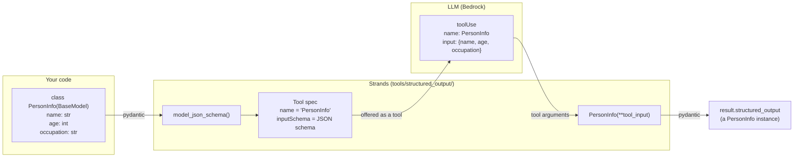
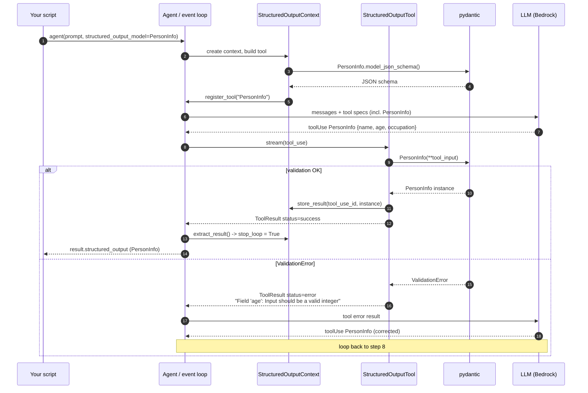
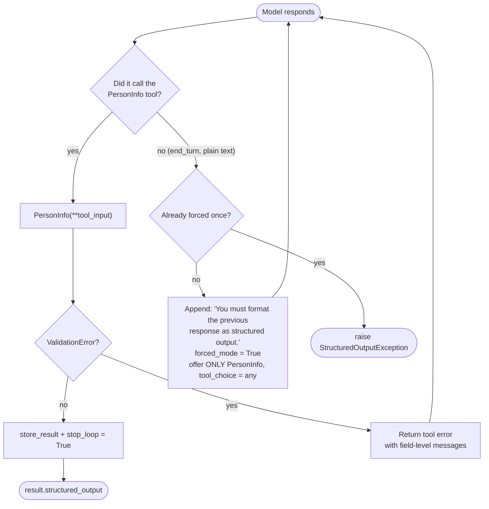
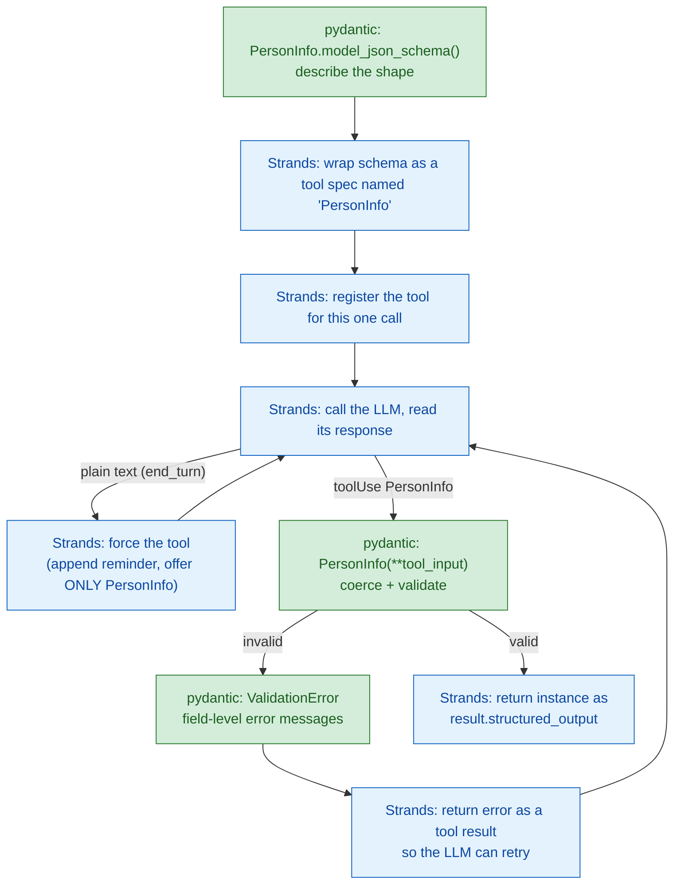

# How Strands applies a pydantic `BaseModel` to LLM output

This folder contains two small scripts that separate the two halves of
"structured output" in Strands:

| File | Calls an LLM? | What it shows |
|---|---|---|
| `structured_output.py` | **Yes** (Amazon Bedrock) | `agent(prompt, structured_output_model=PersonInfo)` returns a validated `PersonInfo` |
| `pydantic_only.py` | **No** | What pydantic itself does: coercion, `ValidationError`, `model_json_schema()` |

The rest of this document answers the question the official docs skip over:

> The `Agent` accepts a `structured_output_model` of type `BaseModel`.
> **How does the Agent know how to apply that `BaseModel` to the raw model output?**

Short answer: **it doesn't parse raw text at all.** Strands turns your `BaseModel`
into a *tool*, forces the LLM to call that tool, and then runs your class's
constructor on the tool arguments. Pydantic contributes exactly two things:
`model_json_schema()` on the way in, and `Model(**args)` / `ValidationError`
on the way out. Everything in between is ordinary tool calling.

Verified against `strands-agents 1.44.0` and `pydantic 2.13.5`. All file paths
below are relative to `.venv/lib/python3.12/site-packages/strands/`.

---

## 1. The big picture



The LLM never sees "please output JSON matching this schema" as free text.
It sees a **tool named after your class** whose parameters are your fields,
and it fills in the parameters the same way it would for any other tool.

---

## 2. Step by step, with the source

### Step 1 – `BaseModel` becomes a tool spec

File: `tools/structured_output/structured_output_tool.py`, class `StructuredOutputTool`

```python
self._tool_spec = self._get_tool_spec(structured_output_model)   # -> convert_pydantic_to_tool_spec(...)
self._tool_spec["description"] = (
    "IMPORTANT: This StructuredOutputTool should only be invoked as the last and final tool "
    "before returning the completed result to the caller. "
    f"<description>{self._tool_spec.get('description', '')}</description>"
)
self._tool_name = self._tool_spec.get("name", "StructuredOutputTool")
```

`convert_pydantic_to_tool_spec` (in `structured_output_utils.py`) calls
`PersonInfo.model_json_schema()` – the exact JSON that `pydantic_only.py`
prints – and packages it as a tool definition:

- **tool name** = the class name, `PersonInfo`
- **description** = the class docstring, wrapped in the "IMPORTANT…" preamble
- **input schema** = your fields, with each `Field(description=...)` preserved

This is why a run prints `Tool #1: PersonInfo`. The model literally called a
tool named after your class.

### Step 2 – The tool is registered for this one call

File: `tools/structured_output/_structured_output_context.py`

When you call `agent(prompt, structured_output_model=PersonInfo)`, Strands
creates a `StructuredOutputContext`, builds the `StructuredOutputTool`, and
`register_tool()` adds it to the agent's tool registry as a *dynamic tool*
next to any real tools you configured. `cleanup()` removes it again after the
call, so it never leaks into the next invocation.

### Step 3 – The LLM fills in the arguments

The model responds with a normal `toolUse` content block:

```json
{
  "name": "PersonInfo",
  "input": { "name": "John Smith", "age": 30, "occupation": "software engineer" }
}
```

At this point the "raw model output" is already JSON shaped by your schema.
There is no regex, no JSON-in-markdown extraction, no prompt parsing.

### Step 4 – Pydantic validates the arguments

File: `tools/structured_output/structured_output_tool.py`, method `stream()`

This single line is the answer to the question:

```python
validated_object = self._structured_output_type(**tool_input)
```

That is `PersonInfo(**tool_input)` – the same constructor call you make by
hand in `pydantic_only.py` with `PersonInfo(name="Ada", age="36", ...)`.

- **Success:** the instance is stored with `context.store_result(tool_use_id, validated_object)`
  and the tool returns `status: "success"`.
- **`ValidationError`:** the `except` branch reformats every pydantic error as
  `Field 'age': Input should be a valid integer…` and returns it as a **tool
  error result** (`status: "error"`). From the model's point of view a tool
  failed with a helpful message, so it retries with corrected arguments.

That is the whole retry loop. It is just pydantic's normal error text being
fed back to the LLM through the standard tool-result channel.

### Step 5 – Forcing, stopping, and giving up

File: `event_loop/event_loop.py` (around lines 363 and 524)

If the model ignores the tool and answers in prose (`stop_reason == "end_turn"`):

1. Strands appends a user message
   `"You must format the previous response as structured output."`
2. It sets `forced_mode = True`, which makes the next model call offer
   **only** the `PersonInfo` tool with `tool_choice = {"any": {}}`, so the
   model has no option but to call it.
3. If the model *still* doesn't call it, `StructuredOutputException` is raised.

Once a validated instance exists, `extract_result()` pulls it out of the
context, sets `stop_loop = True`, and the event loop ends. The instance
surfaces as `result.structured_output`.

---

## 3. Sequence diagram of a single call



---

## 4. Decision flow in the event loop



---

## 5. What pydantic does vs. what Strands does

Green steps are pure pydantic (everything `pydantic_only.py` demonstrates).
Blue steps are Strands plumbing (what `structured_output.py` adds on top).



Mental model for students: **`structured_output_model` = schema-to-tool
converter + `Model(**tool_args)`.** If you understand `pydantic_only.py`, you
already understand the pydantic half of `structured_output.py`. The other half
is plain tool calling.

---

## 6. Caveat: provider-specific overrides

The path above is the generic one and is what Amazon Bedrock uses (the Nova
model in `structured_output.py` goes through it). Some model providers override
`Model.structured_output()` to use a native JSON-schema mode instead of a
forced tool call – for example `models/llamacpp.py` and `models/ollama.py`.
The pydantic side is identical in every case: `model_json_schema()` in,
constructor and `ValidationError` out.

---

## 7. Try it yourself

```bash
# From 06-cv-match/
../.venv/bin/python pydantic/pydantic_only.py       # free, instant, no credentials
../.venv/bin/python pydantic/structured_output.py   # needs AWS credentials, calls Bedrock
```

To watch the tool call happen, run `structured_output.py` and look for
`Tool #1: PersonInfo` in the output. To see the retry loop, change
`age: int` to something stricter such as `age: int = Field(ge=0, le=120)` and
feed the agent a prompt with an impossible age. The model will get a tool error
saying `Field 'age': Input should be less than or equal to 120` and either
correct itself or explain that it cannot comply.

Source files worth reading (all short):

- `strands/tools/structured_output/structured_output_tool.py` – the constructor call and error formatting
- `strands/tools/structured_output/_structured_output_context.py` – registration, forced mode, result extraction
- `strands/tools/structured_output/structured_output_utils.py` – `convert_pydantic_to_tool_spec`
- `strands/event_loop/event_loop.py` – the "force it" and "give up" branches
