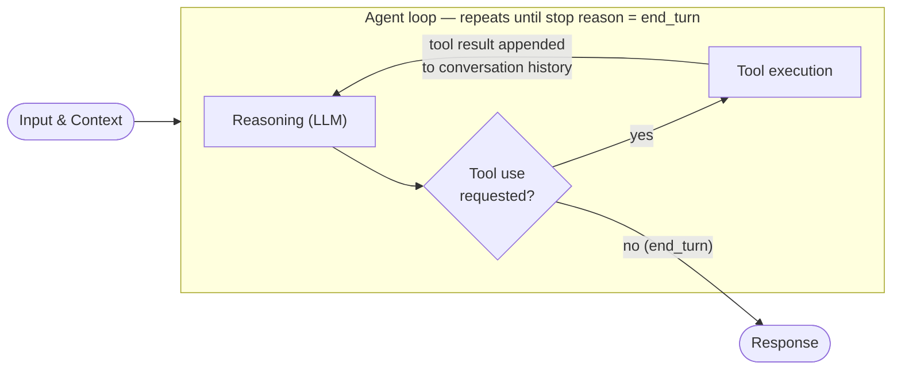
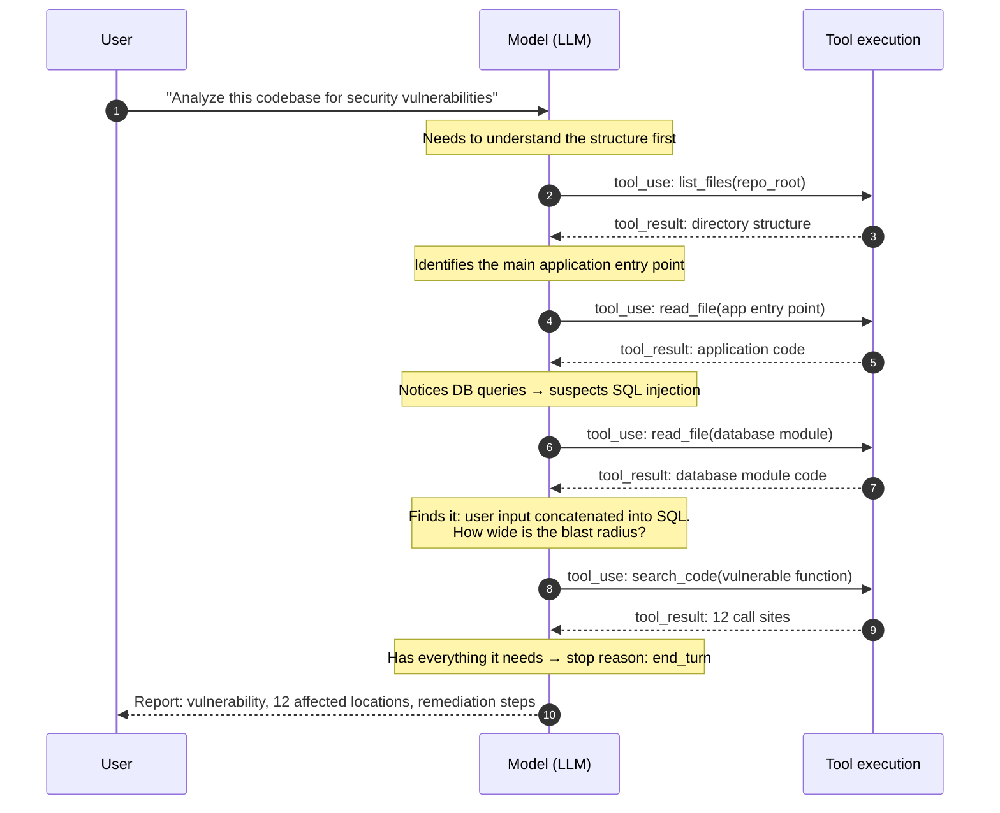
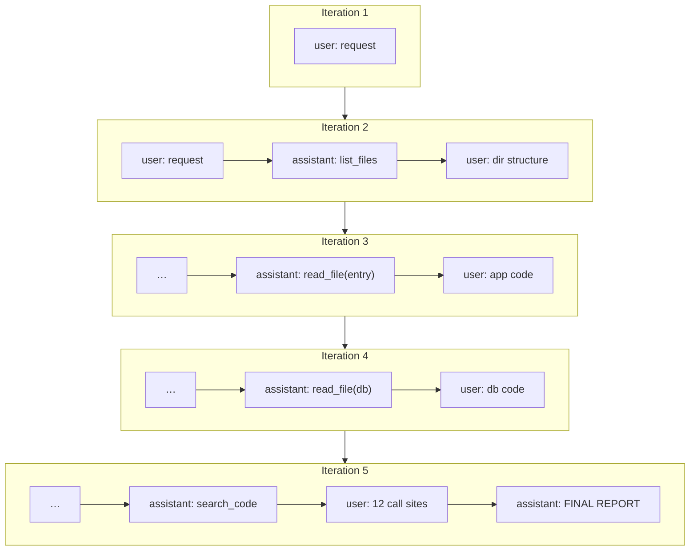
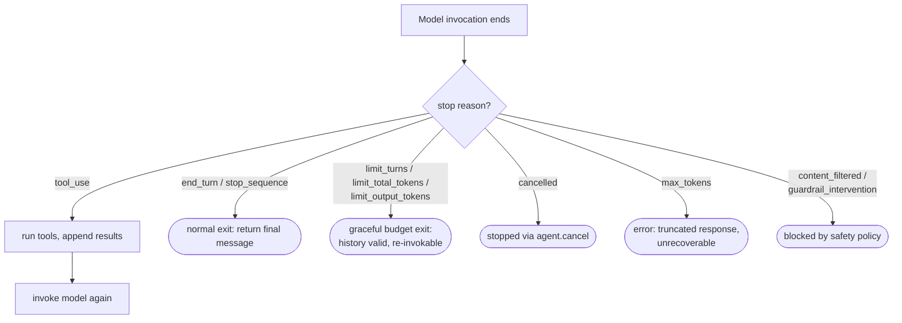

# The Agent Loop — visualized

The agent loop is the foundational concept in Strands: *invoke the model,
check if it wants a tool, run the tool, invoke the model again with the
result — repeat until the model produces a final response.*

This page visualizes the **"A Concrete Example"** section of the official
[Agent Loop](https://strandsagents.com/docs/user-guide/concepts/agents/agent-loop/)
documentation: an agent asked to *analyze a codebase for security
vulnerabilities* — a task no model can do from memory. It needs tools, and
it needs several rounds.

## The loop itself

Each pass through the loop adds to the conversation history. The model sees
not just the original request, but every tool it called and every result it
received — that accumulated context is what enables multi-step reasoning.

## The concrete example: five iterations

Iterations 1–4 end with stop reason **tool use** (the loop continues);
iteration 5 ends with **end turn** (the loop exits). The model chose each
step autonomously based on what it had learned so far.

## What the model sees each iteration

The conversation history grows with every turn — that is the model's working
memory for the task:

Two roles only: **user** messages carry the request *and* every tool result;
**assistant** messages carry text, tool-use requests, and (when supported)
reasoning traces. Tool results are user messages — that is how the world
"talks back" to the model.

## Stop reasons — how the loop decides to continue or exit

## Try it in this repo

- [`01-fundamentals/02_custom_tools.py`](../01-fundamentals/02_custom_tools.py) —
  watch a single loop iteration with a tool call
- [`exercises/tasks/03_chat_agent_logging.md`](../exercises/tasks/03_chat_agent_logging.md) —
  log every tool call and *see* the iterations happen
- Cap the loop with `agent(prompt, limits={"turns": 3})` and check
  `result.stop_reason`

## 📖 Official documentation

- [Agent Loop](https://strandsagents.com/docs/user-guide/concepts/agents/agent-loop/) — the source of this example, plus stop reasons, cancellation, limits
- [Conversation Management](https://strandsagents.com/docs/user-guide/concepts/agents/conversation-management/) — keeping the growing history inside the context window
- [Hooks](https://strandsagents.com/docs/user-guide/concepts/agents/hooks/) — observe before/after each model call and tool execution
