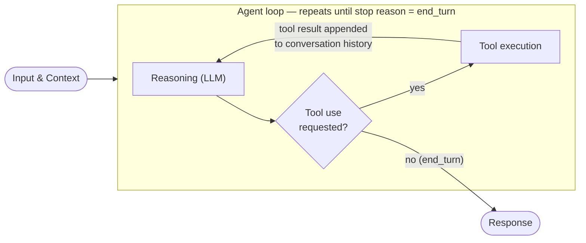
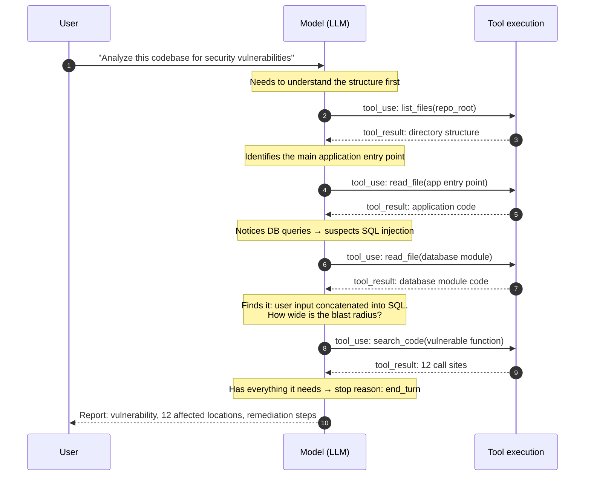
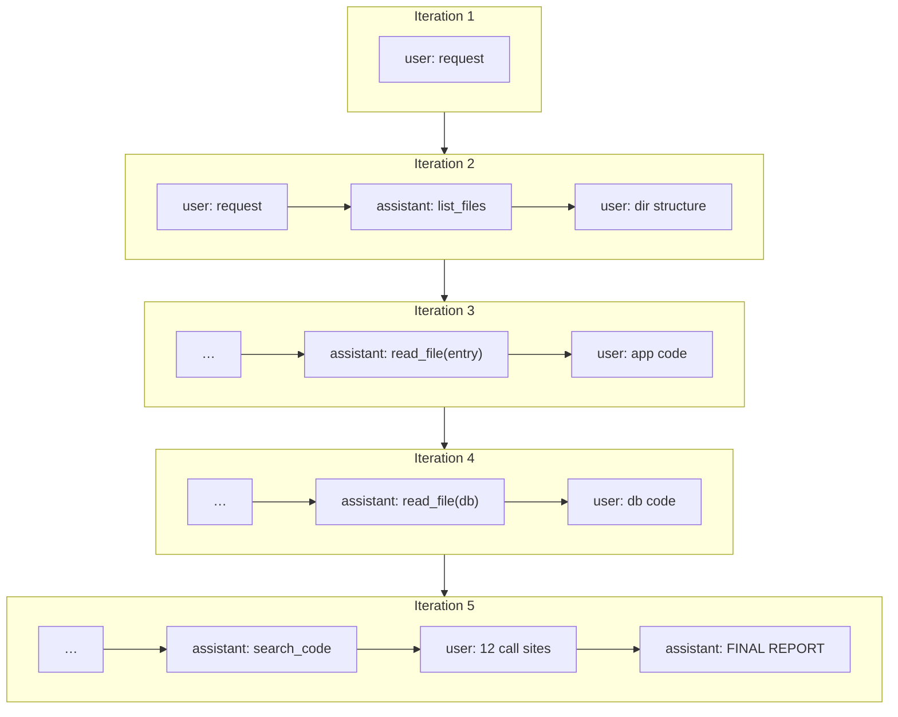
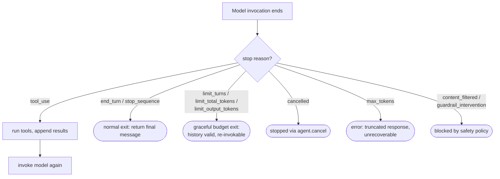
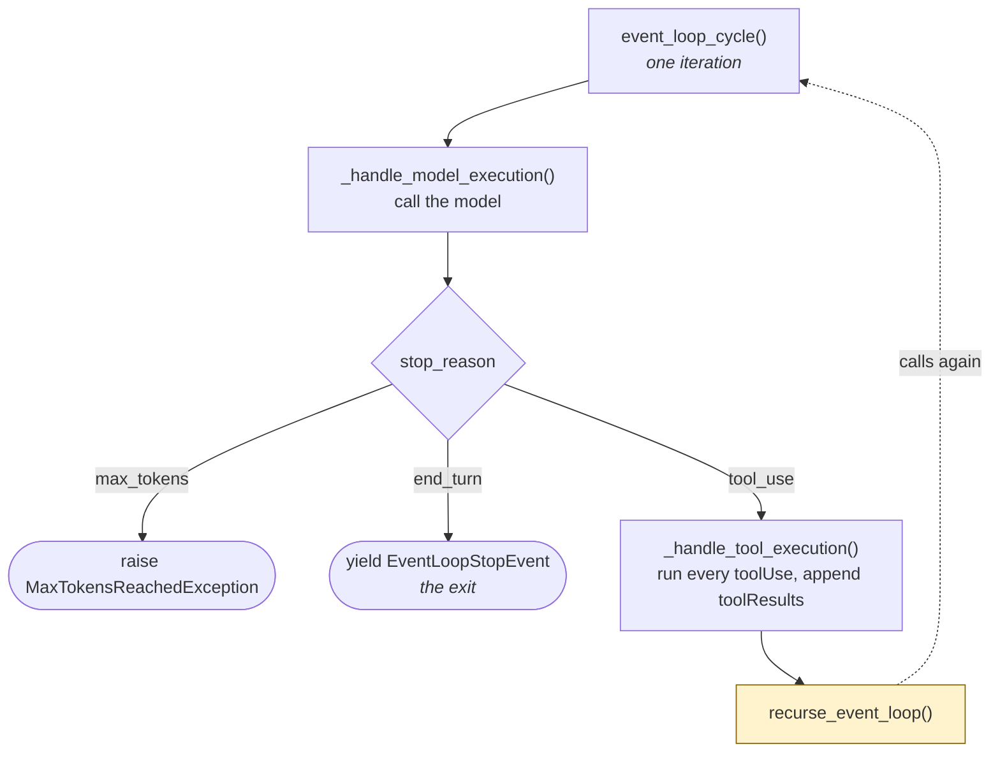

# The Agent Loop — visualized

The agent loop is the foundational concept in Strands: *invoke the model,
check if it wants a tool, run the tool, invoke the model again with the
result — repeat until the model produces a final response.*

This page visualizes the **"A Concrete Example"** section of the official
[Agent Loop](https://strandsagents.com/docs/user-guide/concepts/agents/agent-loop/)
documentation: an agent asked to *analyze a codebase for security
vulnerabilities* — a task no model can do from memory. It needs tools, and
it needs several rounds.

## The loop itself


```mermaid
flowchart LR
    A([Input & Context]) --> Loop
    subgraph Loop["Agent loop — repeats until stop reason = end_turn"]
        direction TB
        B["Reasoning (LLM)"] --> C{"Tool use<br/>requested?"}
        C -- yes --> D["Tool execution"]
        D -- "tool result appended<br/>to conversation history" --> B
    end
    C -- "no (end_turn)" --> E([Response])
```

Each pass through the loop adds to the conversation history. The model sees
not just the original request, but every tool it called and every result it
received — that accumulated context is what enables multi-step reasoning.

## The concrete example: five iterations


```mermaid
sequenceDiagram
    autonumber
    participant U as User
    participant M as Model (LLM)
    participant T as Tool execution

    U->>M: "Analyze this codebase for security vulnerabilities"

    Note over M: Needs to understand the structure first
    M->>T: tool_use: list_files(repo_root)
    T-->>M: tool_result: directory structure

    Note over M: Identifies the main application entry point
    M->>T: tool_use: read_file(app entry point)
    T-->>M: tool_result: application code

    Note over M: Notices DB queries → suspects SQL injection
    M->>T: tool_use: read_file(database module)
    T-->>M: tool_result: database module code

    Note over M: Finds it: user input concatenated into SQL.<br/>How wide is the blast radius?
    M->>T: tool_use: search_code(vulnerable function)
    T-->>M: tool_result: 12 call sites

    Note over M: Has everything it needs → stop reason: end_turn
    M-->>U: Report: vulnerability, 12 affected locations, remediation steps
```

Iterations 1–4 end with stop reason **tool use** (the loop continues);
iteration 5 ends with **end turn** (the loop exits). The model chose each
step autonomously based on what it had learned so far.

### Where does each decision come from?

The yellow notes look like the model "just knowing" things — it doesn't.
Every decision blends two sources:

| Source | What it contributes | Example from the notes |
|---|---|---|
| **Tool results** (context, from the loop) | Facts about *this* codebase — never available from training | the directory listing; the application code showing DB queries; the 12 call sites |
| **Model training** (knowledge) | General expertise and judgment | what an entry point looks like; that string-concatenated SQL is the classic injection pattern; that 12 call sites is enough evidence to stop |

"Notices DB queries → suspects SQL injection" is the moment the two meet: the
model *sees* the queries only because a tool just returned the code, and it
*recognizes the risk* only because of its training. Neither source alone
solves the task. That division of labor — **tools bring the facts, the model
brings the expertise and decides the next step** — is the agent loop.

## What the model sees each iteration

The conversation history grows with every turn — that is the model's working
memory for the task:


```mermaid
flowchart TD
    subgraph I1["Iteration 1"]
        direction LR
        a1["user: request"]
    end
    subgraph I2["Iteration 2"]
        direction LR
        b1["user: request"] --> b2["assistant: list_files"] --> b3["user: dir structure"]
    end
    subgraph I3["Iteration 3"]
        direction LR
        c1["…"] --> c2["assistant: read_file(entry)"] --> c3["user: app code"]
    end
    subgraph I4["Iteration 4"]
        direction LR
        d1["…"] --> d2["assistant: read_file(db)"] --> d3["user: db code"]
    end
    subgraph I5["Iteration 5"]
        direction LR
        e1["…"] --> e2["assistant: search_code"] --> e3["user: 12 call sites"] --> e4["assistant: FINAL REPORT"]
    end
    I1 --> I2 --> I3 --> I4 --> I5
```

Two roles only: **user** messages carry the request *and* every tool result;
**assistant** messages carry text, tool-use requests, and (when supported)
reasoning traces. Tool results are user messages — that is how the world
"talks back" to the model.

## Stop reasons — how the loop decides to continue or exit


```mermaid
flowchart TD
    INV["Model invocation ends"] --> SR{stop reason?}
    SR -- "tool_use" --> RUN["run tools, append results"] --> AGAIN["invoke model again"]
    SR -- "end_turn / stop_sequence" --> OK([normal exit: return final message])
    SR -- "limit_turns / limit_total_tokens /<br/>limit_output_tokens" --> LIM([graceful budget exit:<br/>history valid, re-invokable])
    SR -- "cancelled" --> CAN([stopped via agent.cancel])
    SR -- "max_tokens" --> ERR([error: truncated response,<br/>unrecoverable])
    SR -- "content_filtered /<br/>guardrail_intervention" --> BLK([blocked by safety policy])
```

## In the source: the loop is real code

Is the agent loop a real loop in the SDK, or just "call tools until none are needed"?
It is real code — `strands/event_loop/event_loop.py` (~1,000 lines). And one detail is
worth knowing: **the loop is written as recursion, not as `while True`.**


```mermaid
flowchart TD
    C["event_loop_cycle()<br/><i>one iteration</i>"] --> M["_handle_model_execution()<br/>call the model"]
    M --> SR{stop_reason}
    SR -- "max_tokens" --> X([raise MaxTokensReachedException])
    SR -- "end_turn" --> E([yield EventLoopStopEvent<br/><i>the exit</i>])
    SR -- "tool_use" --> T["_handle_tool_execution()<br/>run every toolUse, append toolResults"]
    T --> R["recurse_event_loop()"]
    R -.->|"calls again"| C
    style R fill:#fff3cd,stroke:#856404
```

Each model turn is one call of `event_loop_cycle()`. If the turn ends with `tool_use`, the
tools run and `recurse_event_loop()` starts the next cycle. If it ends with `end_turn`, the
cycle yields a stop event and the chain unwinds. That chain of calls *is* the loop.

Why recursion? Every function here is an **async generator** that streams events (`yield`) to
the caller — model text, tool starts, tool results. Recursion lets each cycle's events flow
through one generator chain without buffering, and gives every cycle its own trace span
(`Trace("Recursive call", parent_id=...)` — this is why nested cycles appear as a tree in
OpenTelemetry).

Three things the SDK does *inside* the loop that a naive "call until no tools" would not:

| Mechanism | Where | What it does |
|---|---|---|
| **Limits** | `_check_limits()` | Turn/token caps produce a `limit_*` stop reason instead of running forever |
| **Checkpoints / interrupts** | `_build_checkpoint_stop_event()` | The loop can `return` mid-cycle ("after_model" / "after_tools") and be resumed later — this is what human-in-the-loop approval uses |
| **Structured output** | `if structured_output_context.is_enabled and stop_reason == "end_turn"` | If the model said `end_turn` *without* calling the Pydantic tool, the loop injects a prompt, **forces** the tool and recurses once more — that is how `structured_output_model=` guarantees a result |

So, for students: *the model decides whether to loop (by emitting a tool call or not); the SDK
owns the loop itself — executes the tools, appends results, enforces limits, calls the model
again.* Neither half works alone.

**Open the file yourself** (line numbers change between versions, so search by name):

```bash
# from the repo root, with the .venv active
python -c "import strands.event_loop.event_loop as m; print(m.__file__)"
grep -n "async def event_loop_cycle\|async def recurse_event_loop\|async def _handle_tool_execution\|stop_reason == \"tool_use\"\|events = recurse_event_loop" \
  "$(python -c 'import strands.event_loop.event_loop as m; print(m.__file__)')"
```

## Try it in this repo

- [`01-fundamentals/02_custom_tools.py`](../01-fundamentals/02_custom_tools.py) —
  watch a single loop iteration with a tool call
- [`exercises/tasks/03_chat_agent_logging.md`](../exercises/tasks/03_chat_agent_logging.md) —
  log every tool call and *see* the iterations happen
- Cap the loop with `agent(prompt, limits={"turns": 3})` and check
  `result.stop_reason`

## 📖 Official documentation

- [Agent Loop](https://strandsagents.com/docs/user-guide/concepts/agents/agent-loop/) — the source of this example, plus stop reasons, cancellation, limits
- [Conversation Management](https://strandsagents.com/docs/user-guide/concepts/agents/conversation-management/) — keeping the growing history inside the context window
- [Hooks](https://strandsagents.com/docs/user-guide/concepts/agents/hooks/) — observe before/after each model call and tool execution
