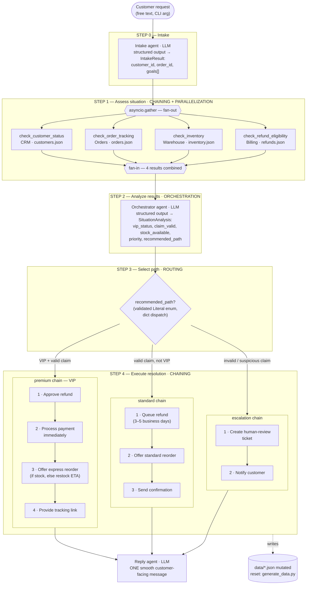

# Reference solution — end-to-end flow

How [`solution_code.py`](solution_code.py) resolves a support ticket, and where
each of the four agent workflow patterns lives. LLM steps run on Amazon Nova
Lite (`amazon.nova-lite-v1:0`); everything else is plain Python.

## Pattern-to-step map

| Pattern | Where | How it shows up in the code |
|---|---|---|
| **Chaining** | backbone + Step 4 | `run_workflow()` runs Steps 0→4 in order; each resolution chain is an ordered sequence of actions (payment never before refund approval) |
| **Parallelization** | inside Step 1 | four independent system checks fanned out with `asyncio.gather`, joined into one assessment |
| **Orchestration** | Step 2 | one agent combines all four results with the customer's goals and produces a typed decision (`SituationAnalysis`) |
| **Routing** | Step 3 | dispatch on the LLM-chosen `recommended_path` enum — a different request takes a different chain |

The three LLM calls (intake, orchestrator, reply) all use Pydantic structured
output or a tight prompt; the deterministic work (lookups, branching, data
mutation) stays in plain Python. Verified transcripts for all three routes:
[`sample_output.md`](sample_output.md).
