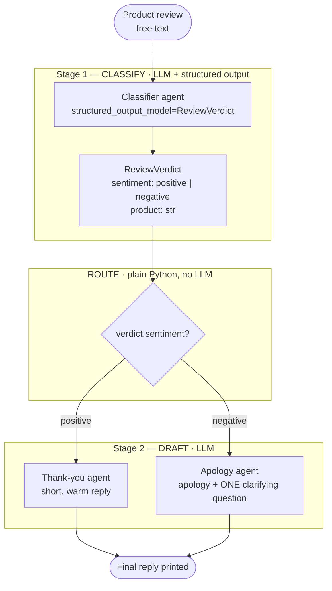
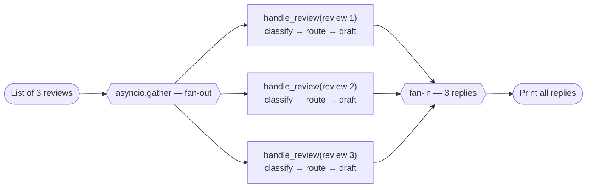

# Task: build a simple agentic workflow

Single agents answer questions; **workflows** coordinate multiple steps.
Build a two-stage *chain* with a *router* — one pattern at a time, before
task 10 combines all four.

Scenario: incoming product reviews.

## The intended flow

Notice where the LLM is and where it is not: the two **stages** are agents
(judgment needed), the **route** in between is a dictionary lookup on a
validated field (determinism needed). Because `sentiment` is a `Literal`,
the router can never receive an unexpected value.

## Steps

1. **Stage 1 — classify** *(structured output)*: an agent reads a review and
   returns a typed verdict: `sentiment: Literal["positive", "negative"]` and
   `product: str`.
2. **Stage 2 — route** *(routing)*: plain Python dispatch on the verdict:
   - `positive` → an agent drafts a short thank-you reply
   - `negative` → an agent drafts an apology + one clarifying question
3. **Chain them**: output of stage 1 feeds stage 2; print the final reply.
   Run it on at least one positive and one negative review, e.g.:
   > "The espresso machine is fantastic, best purchase this year!"
   > "The blender died after two days and support never answered."
4. Bonus *(parallelization)*: process a list of three reviews concurrently
   with `asyncio.gather(...)`.

## Bonus: parallel fan-out

The whole chain above becomes one `async` function; `asyncio.gather` runs it
once per review at the same time:

Pitfall to expect: one `Agent` instance cannot serve concurrent requests
(`ConcurrencyException`). Each parallel branch needs its own agent
instances — they are cheap to create.

Design rule worth internalizing: use an LLM where judgment is needed
(classify, draft), use plain Python where determinism is needed (routing).

## 📖 Official documentation

- [Multi-agent: Workflow](https://strandsagents.com/docs/user-guide/concepts/multi-agent/workflow/) — chaining, routing, parallelization patterns
- [Structured Output](https://strandsagents.com/docs/user-guide/concepts/agents/structured-output/) — typed verdicts for reliable routing
