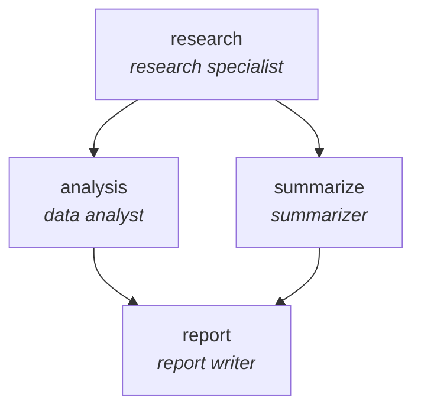
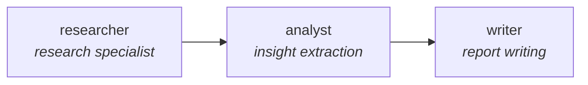
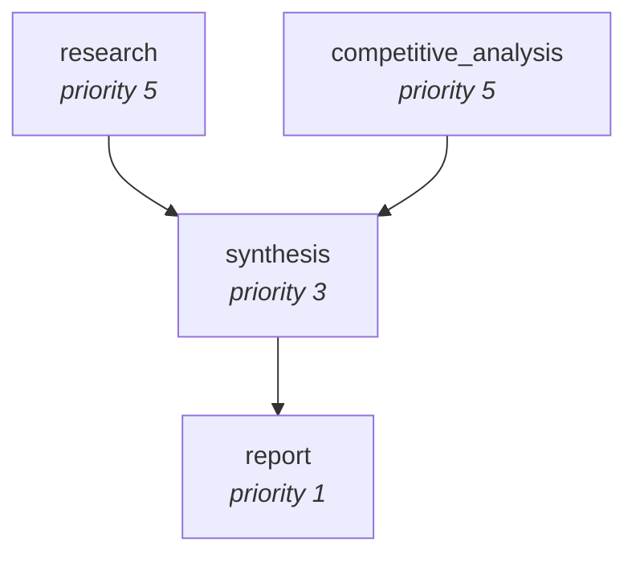

# Graphs and Workflows

Graphs and workflows give you deterministic control over multi-agent execution. Unlike agents-as-tools (where the orchestrator decides flow dynamically), these patterns let you define the exact execution order, dependencies, and parallel paths upfront.

## Files

- **basic_graph.py** - A research pipeline using the Graph API: research → analysis + summarization (parallel fan-out) → report writing. Demonstrates nodes, edges, and parallel execution.
- **workflow.py** - Two approaches to structured workflows:
  1. Manual sequential pipeline - explicit Python control over agent-to-agent data flow
  2. Built-in `workflow` tool - handles task creation, dependency resolution, parallel execution, and state management automatically

## Running

```bash
python basic_graph.py
python workflow.py
```

## Graph Structures

### basic_graph.py — Research pipeline with parallel fan-out

The researcher's output fans out to the analyst and summarizer, which run in parallel. The report writer waits for both before synthesizing the final report.



### workflow.py — Approach 1: Manual sequential workflow

A straight pipeline controlled in Python. Each agent's output becomes the next agent's input.



### workflow.py — Approach 2: Built-in workflow tool

The `workflow` tool resolves dependencies automatically: `research` and `competitive_analysis` have no dependencies so they run in parallel, `synthesis` waits for both, and `report` waits for `synthesis`.



## Key Concepts

- **Nodes**: Each node is an agent (or any callable). Nodes execute when all their incoming edges are satisfied.
- **Edges**: Define dependencies between nodes. An edge from A to B means B waits for A to complete before starting.
- **Parallel fan-out**: Nodes without dependencies on each other run concurrently. In the graph example, analysis and summarization happen simultaneously.
- **Sequential workflows**: The simplest pattern - each agent's output becomes the next agent's input. You control the flow in Python.
- **Workflow tool**: The built-in `workflow` tool handles dependency resolution, parallel execution, pause/resume, and state management. Define tasks with `dependencies` and it figures out the execution order.
- **Context passing**: Each step receives the output of its predecessors. Build context strings that include previous results so each agent has what it needs.
- **When to use**: Pipelines with known structure, fan-out/fan-in patterns, workflows that need guaranteed execution order, and processes requiring audit trails.

## Comparison

| Pattern | Flow Control | Best For |
|---------|-------------|----------|
| Agents as Tools | Orchestrator decides | Separable domains, synthesis |
| Graphs | Defined by edges | Known pipelines, parallelism |
| Swarms | Agents decide | Unknown sequences, exploration |

## Further Reading

- [Strands Agents: Graph Pattern](https://strandsagents.com/docs/user-guide/concepts/multi-agent/graph/)
- [Strands Agents: Workflows](https://strandsagents.com/docs/user-guide/concepts/multi-agent/workflow/)
- [Hands-on Workshop: Build Your First Agent](https://catalog.us-east-1.prod.workshops.aws/workshops/083b80d7-5a90-402b-9bb4-19fb53092808/en-US)
