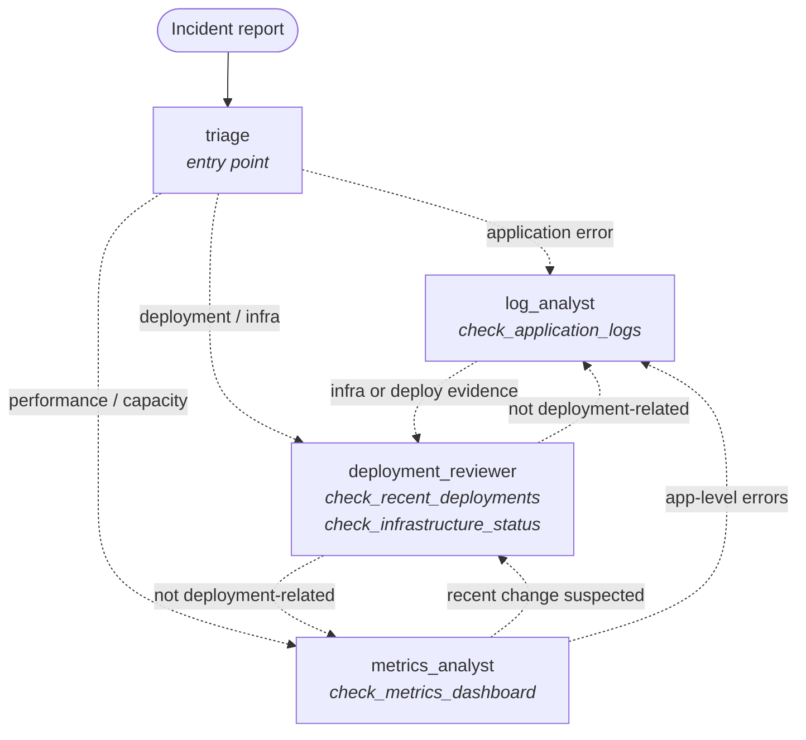
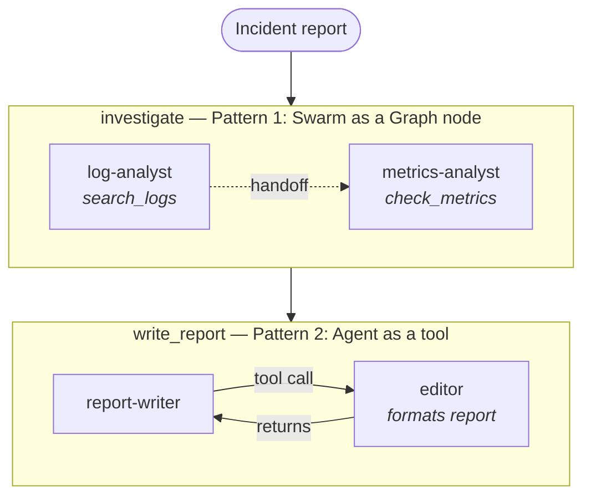

# Swarms

Swarms let agents hand off to each other autonomously - there's no predefined execution order. Each agent decides who to pass control to next based on what it discovers. When one agent hands off to another, it's a full transfer of control, not a function call that waits for a return.

Swarms operate over a shared context, so each agent sees the accumulated work from previous agents - prior findings, handoff history, and state contributed during execution.

## Files

- **debugging_swarm.py** - An incident triage system with four agents: triage, log analyst, metrics analyst, and deployment reviewer. Agents share context and build on each other's discoveries.
- **mixed_patterns.py** - Demonstrates composing patterns together: a Swarm used as a node inside a Graph, and an Agent used as a tool inside another Graph node. Shows that these patterns aren't mutually exclusive.

## Running

```bash
python debugging_swarm.py
python mixed_patterns.py
```

## Swarm Structures

### debugging_swarm.py — Incident triage swarm

Unlike a graph, there is no fixed execution order. Triage is the entry point, and every agent can hand off to any relevant specialist based on what it discovers. Dashed arrows show possible handoffs; the actual path emerges at runtime.



Safety bounds: `max_handoffs=10`, `max_iterations=10`, `execution_timeout=300s`, `node_timeout=120s`, plus repetitive-handoff detection.

### mixed_patterns.py — Swarm as a graph node + agent as a tool

A two-node graph. The first node is itself a swarm (agents hand off internally); the second node is an agent that calls another agent as a tool.



Note the difference between the two arrows inside the nodes: the swarm handoff is a full transfer of control, while the editor tool call is request/response — the report-writer waits for the editor's result and continues.

## Key Concepts

- **Autonomous handoff**: Agents decide who gets control next based on what they discover. The execution path emerges organically.
- **Shared context**: Each agent sees everything prior agents contributed - findings, analysis, handoff reasons. Context accumulates across the swarm.
- **Full transfer**: Unlike agents-as-tools (request/response), a handoff means the current agent's turn is done. The next agent takes over completely.
- **Safety bounds**: Swarms need limits to prevent runaway execution:
  - `max_handoffs` - limits how many times agents can pass control
  - `max_iterations` - caps total agent turns
  - `execution_timeout` - hard time limit
- **Pattern mixing**: Swarms, graphs, and agents-as-tools can compose. A swarm can be a node in a graph. An agent-as-tool can be called from within a graph node.

## When to Use Swarms

- The optimal execution sequence isn't known in advance
- Agents need to build on each other's discoveries
- Collaborative investigation where findings drive the next step
- Complex triage where different specialists are needed based on what's found

## Further Reading

- [Strands Agents: Multi-Agent Patterns](https://strandsagents.com/docs/user-guide/concepts/multi-agent/multi-agent-patterns/)
- [Strands Agents: Swarm](https://strandsagents.com/docs/user-guide/concepts/multi-agent/swarm/)
- [Hands-on Workshop: Build Your First Agent](https://catalog.us-east-1.prod.workshops.aws/workshops/083b80d7-5a90-402b-9bb4-19fb53092808/en-US)
