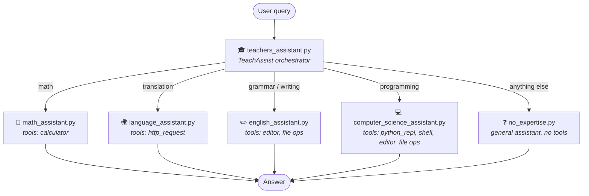

# Multi-Agent Example

This directory contains the implementation files for the Multi-Agent Example
architecture, where specialized agents work together under the coordination of
a central orchestrator.

## Agent Relationship

The orchestrator (`teachers_assistant.py`) classifies each user query and
routes it to exactly one specialist. Each specialist is a `@tool`-decorated
function that internally spins up its own `Agent` (all on
`amazon.nova-lite-v1:0`), optionally with its own tools.



## Implementation Files

- [teachers_assistant.py](teachers_assistant.py) - The main orchestrator agent that routes queries to specialized agents
- [math_assistant.py](math_assistant.py) - Specialized agent for handling mathematical queries
- [language_assistant.py](language_assistant.py) - Specialized agent for language translation tasks
- [english_assistant.py](english_assistant.py) - Specialized agent for English grammar and comprehension
- [computer_science_assistant.py](computer_science_assistant.py) - Specialized agent for computer science and programming tasks
- [no_expertise.py](no_expertise.py) - General assistant for queries outside specific domains

## Running

```bash
python3 teachers_assistant.py
```

Then ask e.g. "What is the square root of 1764?" (routes to the math
assistant) or "Translate 'thank you' to French" (routes to the language
assistant). Type `exit` to quit.

## Documentation

For detailed information about how this multi-agent architecture works, see
the official documentation:
https://strandsagents.com/docs/examples/python/multi_agent_example/multi_agent_example/
